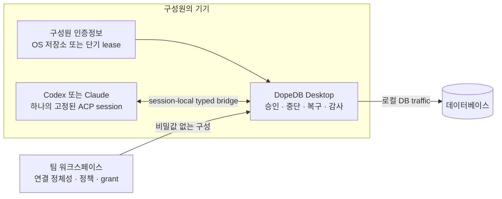

<p align="right">
  <a href="./README.md">English</a> · <strong>한국어</strong>
</p>

<p align="center">
  <a href="https://dopedb.dev/ko">
    
  </a>
</p>

<h1 align="center">DopeDB</h1>

<p align="center">
  <strong>DB 접근은 함께, 인증정보는 각자 보관하세요.</strong>
</p>

<p align="center">
  실제 데이터베이스에 Codex나 Claude를 연결하는 팀을 위한 오픈소스 데이터베이스 워크스페이스입니다.
</p>

<p align="center">
  <a href="https://dopedb.dev/ko"><strong>웹사이트</strong></a> ·
  <a href="https://github.com/json-choi/dopedb/releases/latest"><strong>Alpha 다운로드</strong></a> ·
  <a href="./docs/PROJECT.md"><strong>문서</strong></a> ·
  <a href="./CONTRIBUTING.md"><strong>기여하기</strong></a>
</p>

<p align="center">
  <a href="https://github.com/json-choi/dopedb/actions/workflows/ci.yml"></a>
  <a href="https://github.com/json-choi/dopedb/releases"></a>
  <a href="./LICENSE"></a>
  
</p>

<p align="center">
  <a href="https://dopedb.dev/ko">
    
  </a>
</p>

<p align="center"><sub>DopeDB Desktop · Personal Workspace · 로컬 데이터베이스 실행</sub></p>

## Agent에게 운영 데이터베이스를 맡기기 전에

어려운 일은 SQL을 만드는 것이 아닙니다. 하나의 공용 비밀번호를 배포하거나 저장된
모든 연결을 제한 없는 도구 서버에 열지 않고, 팀원과 Agent가 정확한 권한으로 올바른
데이터베이스에 닿게 하는 일입니다.

DopeDB는 공유 정체성과 정책은 워크스페이스에 두고, 인증정보·DB traffic·승인·중단·
복구·감사는 Desktop 경계에 남깁니다.

| 접근 경로는 함께 공유 | 인증정보는 각자 보관 | Agent session은 정확히 고정 |
| --- | --- | --- |
| 워크스페이스가 연결 정체성, provider resource, 환경 정책, grant, revision을 소유합니다. | 구성원은 OS에 저장한 로컬 인증정보를 사용하거나 최소 권한의 단기 managed 인증정보를 process memory에서만 사용합니다. | Codex나 Claude는 정확한 workspace, account, connection revision, local policy에 묶인 하나의 session 안에서 일합니다. |

## 한눈에 보는 권한 경계



워크스페이스 서비스는 control plane이며 hosted database proxy가 아닙니다. query와
result row는 구성원의 기기에 남습니다. Analysis Article은 정제된 HTML과 정확한
읽기 전용 query 하나만 공유하며, 외부에는 변경 불가능한 HTML 공개본만 노출합니다.

## Alpha에서 지금 사용할 수 있는 것

| 영역 | 현재 제공 범위 |
| --- | --- |
| Workspace | Personal/team workspace, device sign-in, invitation, membership, role |
| 공유 접근 | 비밀값 없는 connection template과 구성원별 local credential binding |
| Managed access | PlanetScale, Neon, GCP Cloud SQL의 구성원별 만료되는 단기 인증정보 |
| 데이터베이스 | PostgreSQL, MySQL/MariaDB, SQLite, MongoDB 연결과 schema introspection |
| Agent runtime | Desktop이 선택한 정확한 권한에 고정된 공식 Codex/Claude ACP session |
| 안전 | 기본 읽기 전용, 불변 write proposal, 사람의 exact approval, 실행 중단, manual transaction rollback, durable result, hash-chain 감사 |
| 로컬 도구 | listening port가 없는 버전 고정 `dopedb` CLI Broker와 Settings → Command line에서 명시적으로 여는 연결 고정 고급 Shell |
| 언어 | 웹사이트, Desktop client, GitHub README의 한국어와 English |

## 의도적으로 좁힌 범위

DopeDB는 범용 desktop database client, text-to-SQL 제품, 상시 실행 범용 MCP
server가 아닙니다. 앱은 AI provider token을 읽거나 갱신하지 않고 AI provider API를
직접 호출하지 않습니다. Agent traffic은 공식 CLI binary와 사용자의 기존 로컬 로그인을
통해서만 이동합니다.

제품은 하나의 DB 접근 경로를 안전하게 공유하고 하나의 Agent grant를 관찰·승인·중단·
복구할 수 있게 만드는 데 집중합니다. 공개 claim 경계와 아직 남은 roadmap 범위는
[제품 방향 정본](./docs/PRODUCT_POSITIONING.md)에서 확인할 수 있습니다.

## Alpha 다운로드

| 플랫폼 | 다운로드 |
| --- | --- |
| macOS · Apple Silicon | [`.dmg` 다운로드](https://github.com/json-choi/dopedb/releases/latest/download/DopeDB-macos-arm64.dmg) |
| macOS · Intel | [`.dmg` 다운로드](https://github.com/json-choi/dopedb/releases/latest/download/DopeDB-macos-x64.dmg) |
| Windows · x64 | [설치 파일 다운로드](https://github.com/json-choi/dopedb/releases/latest/download/DopeDB-windows-x64-setup.exe) |

DopeDB는 현재 alpha입니다. 중요한 데이터베이스에 사용하기 전에
[최신 릴리스](https://github.com/json-choi/dopedb/releases/latest)를 확인하세요.

## 소스에서 실행하기

필요한 도구: Rust stable 1.94 이상, Node.js 24, pnpm 11.17.0, macOS 빌드용
Xcode Command Line Tools.

```sh
pnpm install
pnpm tauri dev
```

개발 앱은 별도의 `DopeDB Dev` 이름과 `dev.dopedb.desktop.dev` identifier를
사용하므로 설치된 운영판이나 운영판의 Local Broker runtime을 가로채지 않습니다.

주요 검증 명령:

```sh
pnpm build
pnpm test
pnpm test:rust
pnpm site:build
```

[프로젝트 가이드](./docs/PROJECT.md)에서 아키텍처, sidecar, Agent session, 안전 동작,
릴리스 경계를 자세히 확인할 수 있습니다.

## 프로젝트 둘러보기

| 시작점 | 내용 |
| --- | --- |
| [프로젝트 가이드](./docs/PROJECT.md) | 아키텍처, 개발, Agent session, 안전, 배포 |
| [제품 포지셔닝](./docs/PRODUCT_POSITIONING.md) | 사용자, 약속, 차별점, 공개 claim 경계 |
| [Workspace roadmap](./docs/WORKSPACE_ROADMAP.md) | 구현된 기반과 alpha에 남은 작업 |
| [UI 범위](./docs/PRODUCT_UI_SCOPE.md) | 기능과 interaction의 정본 결정 |
| [기여 가이드](./CONTRIBUTING.md) | 협업, 검증, branch, pull request |

## 기여하기

기여와 근거가 있는 피드백을 환영합니다. 코드를 변경하기 전에
[CONTRIBUTING.md](./CONTRIBUTING.md)를 읽고, 새로운 제품 surface를 제안하기 전에
[제품 방향](./docs/PRODUCT_POSITIONING.md)을 확인해 주세요.

## 라이선스

DopeDB는 [MIT License](./LICENSE)로 제공됩니다.
