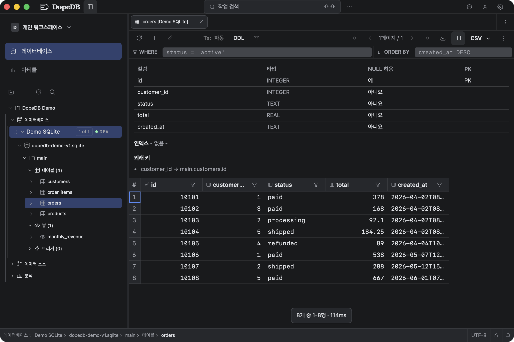
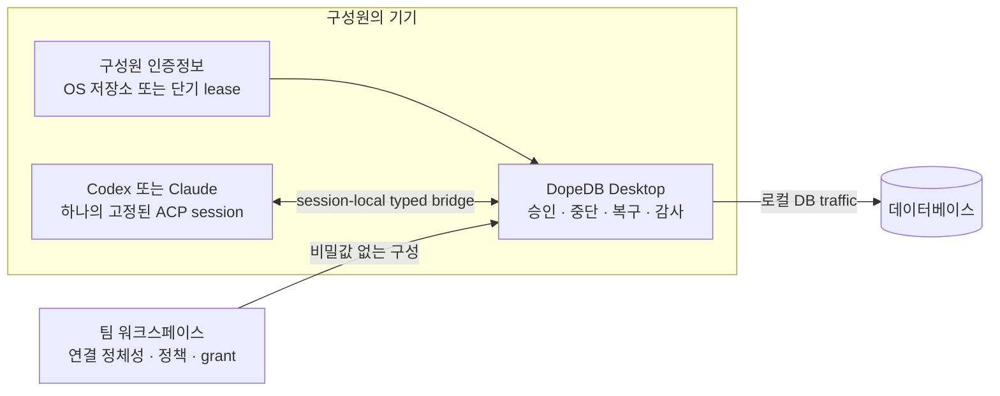

<p align="right">
  <a href="./README.md">English</a> · <strong>한국어</strong>
</p>

<p align="center">
  <a href="https://dopedb.dev/ko">
    
  </a>
</p>

<h1 align="center">DopeDB</h1>

<p align="center">
  <strong>DB 접근은 함께, 인증정보는 각자 보관하세요.</strong>
</p>

<p align="center">
  실제 데이터베이스에 Codex나 Claude를 연결하는 팀을 위한 오픈소스 데이터베이스 워크스페이스입니다.
</p>

<p align="center">
  <a href="https://dopedb.dev/ko"><strong>웹사이트</strong></a> ·
  <a href="https://github.com/json-choi/dopedb/releases/latest"><strong>Alpha 다운로드</strong></a> ·
  <a href="./docs/PROJECT.md"><strong>문서</strong></a> ·
  <a href="./CONTRIBUTING.md"><strong>기여하기</strong></a>
</p>

<p align="center">
  <a href="https://github.com/json-choi/dopedb/actions/workflows/ci.yml"></a>
  <a href="https://github.com/json-choi/dopedb/releases/latest"></a>
  <a href="./LICENSE"></a>
  
</p>

<p align="center">
  <a href="https://dopedb.dev/ko">
    
  </a>
</p>

<p align="center"><sub>DopeDB 0.4.21 · 개인 워크스페이스 · 기본 Demo SQLite · 다크 테마</sub></p>

## Agent에게 운영 데이터베이스를 맡기기 전에

어려운 일은 SQL을 만드는 것이 아닙니다. 하나의 공용 비밀번호를 배포하거나 저장된
모든 연결을 제한 없는 도구 서버에 열지 않고, 팀원과 Agent가 정확한 권한으로 올바른
데이터베이스에 닿게 하는 일입니다.

DopeDB는 공유 정체성과 정책은 워크스페이스에 두고, 인증정보·DB traffic·승인·중단·
복구·감사는 Desktop 경계에 남깁니다.

| 접근 경로는 함께 공유 | 인증정보는 각자 보관 | Agent session은 정확히 고정 |
| --- | --- | --- |
| 워크스페이스가 연결 정보, 클라우드 리소스, 환경 정책, 권한과 변경 버전을 관리합니다. | 구성원은 OS에 저장한 개인 인증정보를 사용하거나 최소 권한의 단기 인증정보를 메모리에서만 사용합니다. | Codex나 Claude는 한 Project에서 명시적으로 선택한 DB·BigQuery·소스만 사용하며, DB 하나까지 쓰기 대상으로 지정할 수 있습니다. |

## 한눈에 보는 권한 경계



DB 실행과 결과 행은 구성원의 기기에 남습니다. Analysis Article을 공유하면 정제된
HTML과 읽기 전용 저장 쿼리 하나의 정의가 업로드됩니다. 외부 독자는 변경 불가능한
HTML 공개본만 볼 수 있고 쿼리를 실행할 수 없습니다. 로그인한 구성원은 Desktop에서
자신의 권한으로 직접 다시 실행합니다.

## Alpha에서 지금 사용할 수 있는 것

| 영역 | 현재 제공 범위 |
| --- | --- |
| Workspace | 개인·팀 워크스페이스, 기기 로그인, 초대, 구성원과 역할 관리 |
| 공유 접근 | 비밀값 없는 연결 템플릿과 구성원별 로컬 인증정보 연결 |
| 관리형 접근 | PlanetScale, Neon, GCP Cloud SQL의 구성원별 만료되는 단기 인증정보 |
| 데이터베이스 | PostgreSQL, MySQL/MariaDB, SQLite, MongoDB와 공식 `bq` CLI를 통한 읽기 전용 Google BigQuery, 스키마 탐색 |
| Agent | 한 Project의 선택한 리소스에 고정된 공식 Codex·Claude ACP 세션과 Desktop에서 승인한 외부 공식 CLI 세션 |
| Article과 초대 | 정제된 HTML과 읽기 전용 저장 쿼리 하나를 공유하며, 수신자 지정 초대를 수락하면 워크스페이스 참여와 읽기 권한 등록을 함께 처리 |
| 안전 | 기본 읽기 전용, 변경 불가능한 쓰기 제안, 정확한 SQL 승인, 실행 중단, 지원 트랜잭션 되돌리기, 결과 보존과 감사 기록 |
| 앱 사용성 | Agent 답변 실시간 스트리밍, 도구 권한 승인 모드, 시스템(기본값)·라이트·다크 테마 선택. DB 쓰기에는 별도 승인이 계속 필요 |
| 로컬 도구 | 수신 포트가 없는 버전 고정 `dopedb` CLI Broker, 비밀값 없는 `.dopedb/agent.json` 구성, 설정 → 명령줄에서 여는 연결 고정 고급 Shell |
| 언어 | 웹사이트, Desktop, GitHub README의 한국어와 영어 |

Article 초대는 지정된 수신자의 로그인이 필요합니다. 앱 설치와 개인 로컬 인증정보
입력은 수신자가 직접 진행합니다. 앱에서 시작한 웹 권한 저장이나 관리형 연결 복구가
완료되면 앱으로 돌아오며, 브라우저가 자동 열기를 막으면 수동 복귀 링크를 사용할 수 있습니다.

## 의도적으로 좁힌 범위

DopeDB는 범용 desktop database client, text-to-SQL 제품, 상시 실행 범용 MCP
server가 아닙니다. 앱은 AI provider token을 읽거나 갱신하지 않고 AI provider API를
직접 호출하지 않습니다. Agent traffic은 공식 CLI binary와 사용자의 기존 로컬 로그인을
통해서만 이동합니다.

제품은 하나의 DB 접근 경로를 안전하게 공유하고 하나의 Agent grant를 관찰·승인·중단·
복구할 수 있게 만드는 데 집중합니다. 공개 claim 경계와 아직 남은 roadmap 범위는
[제품 방향 정본](./docs/PRODUCT_POSITIONING.md)에서 확인할 수 있습니다.

## 공식 AI CLI에서 사용하기

CLI와 승인된 Agent 세션에서의 스키마 비교는 [CLI 스키마 Diff 안내](docs/contracts/cli-schema-diff.md)를 참고하세요.

Desktop 설정에서 앱과 버전이 같은 `dopedb` 명령을 설치하고, Project 루트에서
한 번 실행합니다.

```sh
dopedb agent init --provider codex # Claude는 --provider claude
```

Desktop 승인 화면에서 DB, BigQuery 리소스, 소스 저장소와 선택적인 쓰기 대상 DB
하나를 고릅니다. 생성되는 `.dopedb/agent.json`에는 식별자만 들어갑니다.
DB 비밀번호나 AI 공급자 인증정보 없이 검토하고 저장소에 커밋할 수 있습니다.
[영문 README의 구성 예시](./README.md#use-dopedb-from-an-official-ai-cli)도 참고하세요.

```sh
dopedb agent start
```

공식 CLI에 추가 인수를 전달하려면 `--` 뒤에 붙입니다.
시작할 때마다 Desktop에서 현재 리소스 범위를 확인합니다. 권한은 실행한 CLI의
프로세스에만 연결되며 CLI가 종료되면 회수됩니다. 범위를 바꾸려면 기존 구성 파일을
명시적으로 제거하고 `agent init`의 Desktop 검토를 다시 진행합니다.

## Alpha 다운로드

| 플랫폼 | 다운로드 |
| --- | --- |
| macOS · Apple Silicon | [`.dmg` 다운로드](https://github.com/json-choi/dopedb/releases/latest/download/DopeDB-macos-arm64.dmg) |
| macOS · Intel | [`.dmg` 다운로드](https://github.com/json-choi/dopedb/releases/latest/download/DopeDB-macos-x64.dmg) |
| Windows · x64 | [설치 파일 다운로드](https://github.com/json-choi/dopedb/releases/latest/download/DopeDB-windows-x64-setup.exe) |

DopeDB는 현재 alpha입니다. 중요한 데이터베이스에 사용하기 전에
[최신 릴리스](https://github.com/json-choi/dopedb/releases/latest)를 확인하세요.

현재 macOS 정식 배포본은 Developer ID 서명과 Apple 공증을 거칩니다.
Windows 설치 파일은 아직 코드 서명 전이어서 SmartScreen 경고가 표시될 수 있습니다.
위의 공식 릴리스 링크에서 다운로드하세요.

## 소스에서 실행하기

필요한 도구: Rust stable 1.94 이상, Node.js 24, pnpm 11.25.0, macOS 빌드용
Xcode Command Line Tools.

```sh
pnpm install
pnpm tauri dev
```

개발 앱은 별도의 `DopeDB Dev` 이름과 `dev.dopedb.desktop.dev` identifier를
사용하므로 설치된 운영판이나 운영판의 Local Broker runtime을 가로채지 않습니다.

주요 검증 명령:

```sh
pnpm build
pnpm test
pnpm test:rust
pnpm site:build
```

[프로젝트 가이드](./docs/PROJECT.md)에서 아키텍처, sidecar, Agent session, 안전 동작,
릴리스 경계를 자세히 확인할 수 있습니다.

## 프로젝트 둘러보기

| 시작점 | 내용 |
| --- | --- |
| [프로젝트 가이드](./docs/PROJECT.md) | 아키텍처, 개발, Agent session, 안전, 배포 |
| [제품 포지셔닝](./docs/PRODUCT_POSITIONING.md) | 사용자, 약속, 차별점, 공개 claim 경계 |
| [Workspace roadmap](./docs/WORKSPACE_ROADMAP.md) | 구현된 기반과 alpha에 남은 작업 |
| [UI 범위](./docs/PRODUCT_UI_SCOPE.md) | 기능과 interaction의 정본 결정 |
| [기여 가이드](./CONTRIBUTING.md) | 협업, 검증, branch, pull request |

## 기여하기

기여와 근거가 있는 피드백을 환영합니다. 코드를 변경하기 전에
[CONTRIBUTING.md](./CONTRIBUTING.md)를 읽고, 새로운 제품 surface를 제안하기 전에
[제품 방향](./docs/PRODUCT_POSITIONING.md)을 확인해 주세요.

## 라이선스

DopeDB는 [MIT License](./LICENSE)로 제공됩니다.
