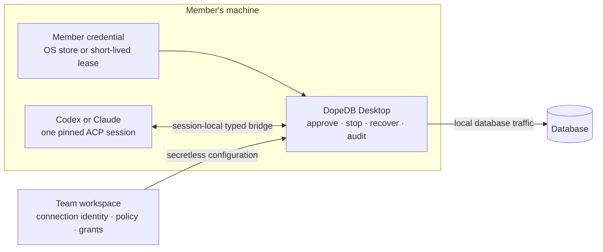

<p align="right">
  <strong>English</strong> · <a href="./README.ko.md">한국어</a>
</p>

<p align="center">
  <a href="https://dopedb.dev">
    
  </a>
</p>

<h1 align="center">DopeDB</h1>

<p align="center">
  <strong>Share database access. Keep credentials personal.</strong>
</p>

<p align="center">
  An open-source database workspace for teams that use Codex or Claude against real databases.
</p>

<p align="center">
  <a href="https://dopedb.dev"><strong>Website</strong></a> ·
  <a href="https://github.com/json-choi/dopedb/releases/latest"><strong>Download alpha</strong></a> ·
  <a href="./docs/PROJECT.md"><strong>Documentation</strong></a> ·
  <a href="./CONTRIBUTING.md"><strong>Contribute</strong></a>
</p>

<p align="center">
  <a href="https://github.com/json-choi/dopedb/actions/workflows/ci.yml"></a>
  <a href="https://github.com/json-choi/dopedb/releases"></a>
  <a href="./LICENSE"></a>
  
</p>

<p align="center">
  <a href="https://dopedb.dev">
    
  </a>
</p>

<p align="center"><sub>DopeDB Desktop · Personal Workspace · local database execution</sub></p>

## Before you hand an Agent your production database

The hard part is not generating SQL. It is letting a teammate or Agent reach the
right database with the right authority—without distributing one shared password
or exposing every saved connection through an unrestricted tool server.

DopeDB keeps shared identity and policy in the workspace, while credentials,
database traffic, approval, stop, recovery, and audit stay at the Desktop boundary.

| Share the access path | Keep credentials personal | Pin every Agent session |
| --- | --- | --- |
| The workspace owns connection identity, provider resource, environment policy, grants, and revisions. | Each member uses an OS-stored local credential or a least-privilege, short-lived managed credential held only in process memory. | Codex or Claude works inside one session bound to the exact workspace, account, connection revision, and local policy. |

## The boundary at a glance



The workspace service is a control plane, not a hosted database proxy. Queries and
result rows stay on the member's machine. An Analysis Article shares sanitized HTML
and one exact read-only query; only its immutable HTML publication is public.

## What ships in the alpha

| Area | Available today |
| --- | --- |
| Workspace | Personal and team workspaces, device sign-in, invitations, membership, and roles |
| Shared access | Secretless connection templates with per-member local credential bindings |
| Managed access | Member-specific, expiring credentials for PlanetScale, Neon, and GCP Cloud SQL |
| Databases | PostgreSQL, MySQL/MariaDB, SQLite, MongoDB, and read-only Google BigQuery through the official `bq` CLI, with schema introspection |
| Agent runtime | Official Codex and Claude ACP sessions plus Desktop-approved external official CLI sessions, each pinned to an exact selected Project resource set |
| Safety | Read-only defaults, immutable write proposals, exact human approval, cancellation, manual transaction rollback, durable results, and hash-chained audit |
| Local tools | A version-matched `dopedb` CLI Broker with no listening port, secret-free `.dopedb/agent.json` setup, and an explicit connection-pinned advanced Shell under Settings → Command line |
| Languages | English and Korean across the website, Desktop client, and GitHub README |

## Intentionally focused

DopeDB is not a universal desktop database client, a text-to-SQL product, or an
always-on general-purpose MCP server. The app never reads or refreshes an AI
provider token and never calls an AI provider API directly; Agent traffic runs
through the official CLI binary and the user's existing local login.

The product focuses on making one database access path safely shareable and one
Agent grant observable, approvable, stoppable, and recoverable. See the
[canonical product direction](./docs/PRODUCT_POSITIONING.md) for the public claim
boundary and open roadmap limits.

## Use DopeDB from an official AI CLI

Install the version-matched `dopedb` command from Desktop Settings, then run this
once from a Project root:

```sh
dopedb agent init --provider codex # or: claude
```

Choose the Project databases, BigQuery resources, source repositories, and
optional single write target in the Desktop approval window. The generated
`.dopedb/agent.json` contains identifiers only, so it can be reviewed and checked
in without distributing database or AI-provider credentials. Start the configured
official CLI with:

```json
{
  "schemaVersion": 1,
  "provider": "codex",
  "projectId": "11111111-1111-4111-8111-111111111111",
  "anchorConnectionId": "22222222-2222-4222-8222-222222222222",
  "resourceScopes": [
    {
      "projectEnvironmentId": "33333333-3333-4333-8333-333333333333",
      "authorityConnectionId": "22222222-2222-4222-8222-222222222222",
      "connectionIds": ["22222222-2222-4222-8222-222222222222"],
      "sourceIds": ["44444444-4444-4444-8444-444444444444"]
    }
  ]
}
```

`writeConnectionId` is optional and, when present, must identify exactly one of
the selected databases. To change scope, explicitly remove the old file and run
`agent init` through Desktop review again rather than editing IDs to widen it;
every start resolves the current revisions and fails closed if the Project set
changed.

```sh
dopedb agent start -- <provider arguments>
```

Desktop reviews the exact current resource set on every start. The Broker grants
only that process tree a runtime-only session and revokes it when the CLI exits;
it does not install an always-on MCP server or read the provider's local login.

## Download the alpha

| Platform | Download |
| --- | --- |
| macOS · Apple Silicon | [Download `.dmg`](https://github.com/json-choi/dopedb/releases/latest/download/DopeDB-macos-arm64.dmg) |
| macOS · Intel | [Download `.dmg`](https://github.com/json-choi/dopedb/releases/latest/download/DopeDB-macos-x64.dmg) |
| Windows · x64 | [Download installer](https://github.com/json-choi/dopedb/releases/latest/download/DopeDB-windows-x64-setup.exe) |

DopeDB is currently an alpha. Review the
[latest release](https://github.com/json-choi/dopedb/releases/latest) before using
it with an important database.

## Run from source

Requirements: Rust stable 1.94+, Node.js 24, pnpm 11.17.0, and Xcode Command
Line Tools for macOS builds.

```sh
pnpm install
pnpm tauri dev
```

The development app uses the separate `DopeDB Dev` name and
`dev.dopedb.desktop.dev` identifier, so it does not replace an installed
release or take over its local Broker runtime.

Useful checks:

```sh
pnpm build
pnpm test
pnpm test:rust
pnpm site:build
```

The [project guide](./docs/PROJECT.md) covers architecture, sidecars, Agent
sessions, safety behavior, and release boundaries.

## Explore the project

| Start here | What it contains |
| --- | --- |
| [Project guide](./docs/PROJECT.md) | Architecture, development, Agent sessions, safety, and distribution |
| [Product positioning](./docs/PRODUCT_POSITIONING.md) | Audience, promise, differentiation, and public claim limits |
| [Workspace roadmap](./docs/WORKSPACE_ROADMAP.md) | Shipped foundations and remaining alpha work |
| [UI scope](./docs/PRODUCT_UI_SCOPE.md) | Canonical feature and interaction decisions |
| [Contributing guide](./CONTRIBUTING.md) | Collaboration, checks, branches, and pull requests |

## Contributing

Contributions and evidence-backed feedback are welcome. Read
[CONTRIBUTING.md](./CONTRIBUTING.md) before changing code, and check the
[product direction](./docs/PRODUCT_POSITIONING.md) before proposing a new product
surface.

## License

DopeDB is available under the [MIT License](./LICENSE).
