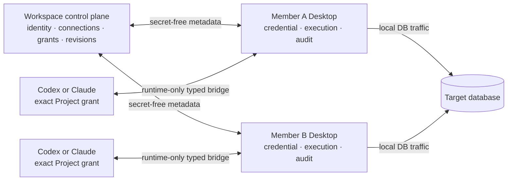

# Workspace Collaboration Roadmap

Status: maintained alpha roadmap, updated 2026-09-03.

This document tracks the remaining work needed to harden DopeDB's team workspace.
It does not define product scope. Scope is owned by
[Product Positioning](./PRODUCT_POSITIONING.md),
[Product UI Scope](./PRODUCT_UI_SCOPE.md), and accepted ADRs.

## Product outcome

DopeDB is a shared database-access workspace for teams and AI agents. The hosted
service owns identity, secret-free connection records, policy, provider resources,
revisions, and collaboration audit. Desktop owns credentials, database traffic,
execution, approval, cancellation, recovery, and local result rows.

Work is prioritized in this order:

1. Make sharing one connection and obtaining member-specific access reliable.
2. Complete provider discovery, least-privilege issuance, revoke, expiry, and drift.
3. Enforce every Agent operation inside one exact Project resource grant.
4. Keep the simple HTML Analysis Article and immutable public publication reliable.
5. Deepen schema introspection where it materially improves Agent judgment.

Driver count, a general database-client feature list, dashboards, text-to-SQL, and an
always-on general MCP server are not workspace exit criteria.

## Architecture boundary

- `workspace-cloud/` is the authenticated web and API control plane at
  `app.dopedb.dev`; `site/` is the separate public marketing deployment.
- Hosted PostgreSQL stores collaboration metadata. Desktop never connects to that
  database directly.
- Member-local credentials stay in each member's OS credential store.
- Managed access uses provider-native or approved broker authority to issue a
  member-specific, least-privilege, short-lived database credential. The issued
  secret is delivered once and kept only in Desktop process memory.
- Target-database traffic never passes through Workspace Cloud.
- Provider discovery and authentication use the provider's official CLI where the
  app is the caller. DopeDB does not read a provider token and call its API directly.
- Codex and Claude run through their official adapters or official local CLIs. Every
  Agent session is bound to the current workspace, account, exact selected Project
  resources, process ancestry, local policy, and at most one write target.

## Shared and local data

| Resource | Workspace Cloud | Desktop only |
| --- | --- | --- |
| Connection | engine, endpoint fields, environment, safety ceiling, revision, grant, redacted provider selector | username, password, token, certificate, connection URL, local secret reference, live pool |
| Provider integration | encrypted provider authorization or keyless trust metadata, verified scope, lifecycle and audit | one-time issued DB credential and local transport diagnostics |
| Project | resource identity, Environment bindings, exact revisions and grants | Local Folder absolute path and member-specific credential binding |
| Agent session | no transcript, capability, SQL, result, or process token | exact runtime grant, process binding, transcript, proposals and execution results |
| Analysis Article | sanitized HTML, one read-only query definition, exact connection content revision, immutable revisions, manual run receipt metadata | query result rows and bounded encrypted recovery artifact |
| Public article | immutable sanitized HTML snapshot, slug state, publisher receipt | saved query, private result, database grant, rerun command |
| Audit | collaboration changes and redacted authority receipts | full local query and operation audit |

Workspace roles never grant target-database privileges. The credential used on the
member's device and the database's own roles remain authoritative.

## Current Analysis Article contract

[ADR 0007](./adr/0007-analysis-article-bi-domain.md) owns this contract:

- one sanitized HTML body;
- exactly one non-empty bounded read-only query;
- exactly one connection content revision pin;
- immutable edit history;
- an explicit Desktop-only manual run with cancellation and authority rechecks;
- local-only result rows and a hosted query receipt;
- an optional immutable public HTML publication with no query or session path.

There is no parameter surface, transform graph, visualization block registry,
multi-query join, schedule, background runner selection, freshness monitor, result
upload, metric signal, or hosted database execution.

The serializer and every storage boundary accept only the compact current definition.
Pre-MVP Article definitions, lifecycle fields, automation records, result fragments,
and migration archives are unsupported and have no parser, table, route, or UI path.

## Authorization model

Workspace role and connection grant are separate narrowing layers.

| Capability | Viewer | Analyst | Editor | Admin | Owner |
| --- | ---: | ---: | ---: | ---: | ---: |
| View current Articles for granted connections | yes | yes | yes | yes | yes |
| Run an allowed shared read locally | no | yes | yes | yes | yes |
| Create or update a shared Article | no | no | yes | yes | yes |
| Edit an Article or publish immutable HTML | no | no | yes | yes | yes |
| Manage connection policy and grants | no | no | no | yes | yes |
| Invite, remove, or change member roles | no | no | no | yes | yes |
| Delete the workspace | no | no | no | no | yes |

Every database operation is narrowed by all applicable layers:

1. active account and workspace session;
2. current membership and workspace role;
3. exact Project Environment/resource revision;
4. explicit connection grant;
5. provider and database credential capability;
6. Desktop safety policy;
7. exact proposal approval when the caller did not author the mutation;
8. target database privilege and read-only/transaction enforcement.

A cached role is only a UI hint. Revocation and mutation paths lock and recheck the
authoritative rows before committing.

## Implemented foundation

- Personal and team workspaces, device sign-in, invitations, roles, and member removal.
- Secret-free shared connection templates and member-local credential bindings.
- Per-connection `view`, `use`, and `manage` grants.
- Managed PlanetScale, Neon, GCP Cloud SQL, and allowlisted Vault access paths.
- Provider credential lease issuance, early revoke, provider expiry, and deferred
  cleanup through exact due-time scheduling rather than idle PostgreSQL polling.
- Project and Environment resource binding for databases, BigQuery, and source code.
- Exact-resource Desktop ACP sessions and Desktop-approved external
  `dopedb agent init/start` sessions.
- Local read-only enforcement, immutable write proposals, exact approvals,
  cancellation, rollback, result recovery, and hash-chained local audit.
- Compact HTML Analysis Articles, immutable revisions, manual Desktop rerun receipts,
  cancellation, and immutable public HTML publications.
- KMS-wrapped metadata backup, resumable key rotation, and reversible Owner workspace
  deletion in the control plane.

Implemented does not mean production validation is complete. Public claims remain
bounded by [Product Positioning](./PRODUCT_POSITIONING.md).

## Remaining alpha work

### Shared connection reliability

- Finish packaged two-member tests for create, grant, local binding, managed lease,
  revoke, reconnect, duplicate prevention, and member removal.
- Verify that every permission error links to the single authoritative Safety or
  Workspace database-access surface and reports the exact missing layer.
- Verify macOS and Windows credential-store isolation across multiple signed-in
  accounts and workspace switches.

### Provider lifecycle

- Run production discovery/import/lease/revoke/drift scenarios for every shipped
  provider with redacted evidence.
- Verify scheduler outages never extend provider credentials and that the next request
  performs bounded repair without periodic database polling.
- Complete recovery UX for revoked OAuth/provider authority while preserving connection
  IDs, Project bindings, and member grants.

### Project and Agent authority

- Complete packaged Project-context selection across arbitrary combinations of
  databases, BigQuery resources, and source repositories.
- Prove a stale resource revision, account change, workspace switch, process exit, or
  grant revoke stops the exact session without affecting unrelated work.
- Complete signed adapter distribution and remove transitional launcher code only
  after independently verified parity.

### Analysis Article validation

- Verify two members can read the same Article definition and manually run its query
  with independent credentials while result rows remain local.
- Verify restart recovery preserves the last bounded local success and a failed rerun
  does not erase it.
- Verify publication creates and revokes one immutable HTML snapshot and exposes no
  saved SQL, private result, workspace enumeration, or rerun path.
- Verify unsupported pre-MVP Article payloads fail closed at both HTTP and Desktop
  boundaries while current manual-run and publication records remain round-trippable.

### Sync, backup, and recovery

- Complete full bidirectional projection validation, cursor compaction/rebase, offline
  replay, conflict visibility, KMS restore, and cross-account isolation.
- Verify destructive workspace lifecycle actions against live KMS and production
  PostgreSQL with explicit recovery evidence.

## Validation requirements

Every completed item needs evidence proportional to its risk:

- Rust and TypeScript contract checks for wire changes;
- cross-workspace, stale-revision, explicit-deny, and confused-deputy tests;
- credential and sensitive-data leak checks for logs, analytics, crash reports, sync,
  and backups;
- macOS and Windows packaged behavior for credential and process boundaries;
- target database tests proving Workspace state cannot bypass database read-only or
  privilege enforcement;
- retry, cancellation, process exit, provider timeout, and partial-failure recovery;
- no hidden scheduler, hosted result storage, or always-on database endpoint.

Do not close a live-validation issue from unit tests alone. Record the account,
provider, app version, exact scenario, redacted evidence, and remaining failure before
removing its validation label.

## Deferred decisions

- Knowledge graph construction is not shipped. A new implementation starts only after
  a benchmark proves material quality or latency gains relative to GitHub exact-commit
  reads and operating cost, and a paid or experimental entitlement is explicitly approved.
- Additional providers and engines require verified demand and a complete connection,
  revoke, drift, and platform test plan.
- Enterprise SSO/SCIM, configurable retention, data residency beyond the current
  deployment, and self-hosted control-plane packaging remain separate decisions.
- Cross-device Personal Workspace database, credential, and Local Folder sync is not
  implied by account sign-in.
