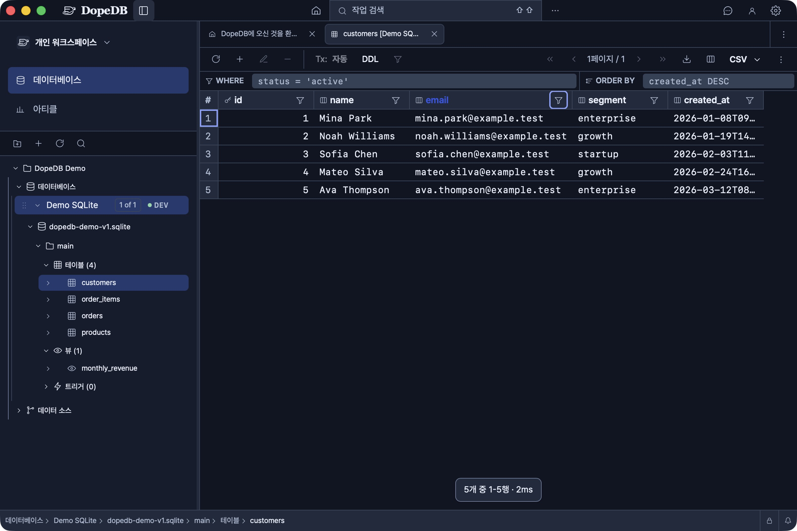
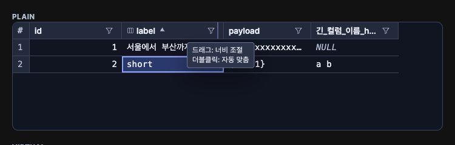
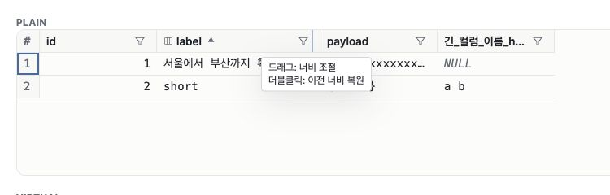

# 열 자동 맞춤 검수

2026-10-04, 한국어·다크 테마에서 확인했다.

- macOS 개발 앱의 Demo SQLite `customers`: email 경계 더블클릭으로
  144px에서 245px로 맞춰졌고 다른 열은 144px을 유지했다.
- 실제 공용 DataGrid 브라우저 fixture: 경계 focus 시 두 줄 힌트를 확인했다.
  일반·가상·빈 결과·부분 stream의 맞춤, 480px 상한과 keyboard resize도 확인했다.
- 개발 앱과 브라우저 검수이며 macOS·Windows packaged runtime 검수는 남아 있다.
  힌트 캡처는 focus 상태이며 native hover 검수의 증거로 사용하지 않는다.

## 이전 너비 복원

일반·가상·빈 결과·부분 stream fixture에서 더블클릭으로 맞춘 뒤 재실행하면
144px로 복원됨을 확인했다. 방향키로 152px로 바꾼 뒤 Enter 자동 맞춤·복원도
152px를 되돌렸다. 맞춤 상태에서는 둘째 힌트가 이전 너비 복원으로 바뀐다.

